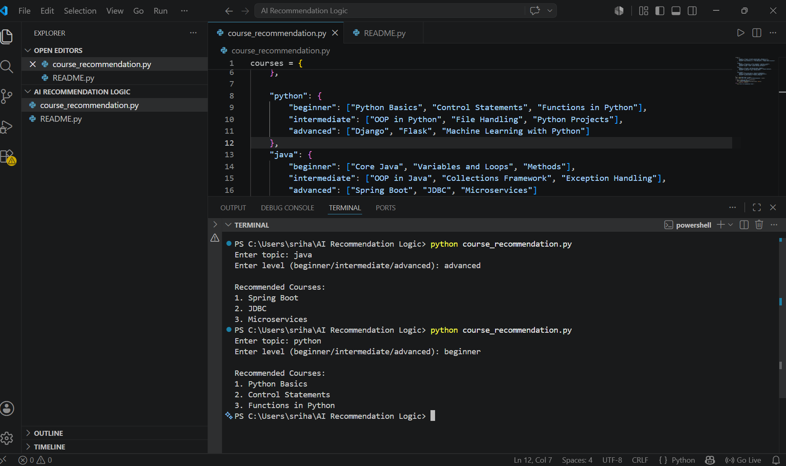

# Course Recommendation System

## Overview

This project demonstrates a simple recommendation system that suggests courses based on the user's selected topic and skill level. The system uses predefined course data and recommendation logic to provide relevant course suggestions.

## Technologies Used

- Python

## Dataset

- Course Dataset (C, Python, Java, and Data Science)
- Beginner, Intermediate, and Advanced Levels

## Result

The recommendation system successfully provides personalized course suggestions based on the user's interests and proficiency level.

### Output

- User selects a topic
- User selects a skill level
- Relevant courses are recommended
- Appropriate message displayed if no match is found

### Screenshot

## Conclusion

The Course Recommendation System successfully demonstrates the basic concept of recommendation logic by matching user preferences with relevant courses. The project highlights how user interests and skill levels can be utilized to generate personalized recommendations, serving as a foundation for more advanced AI-based recommendation systems.
